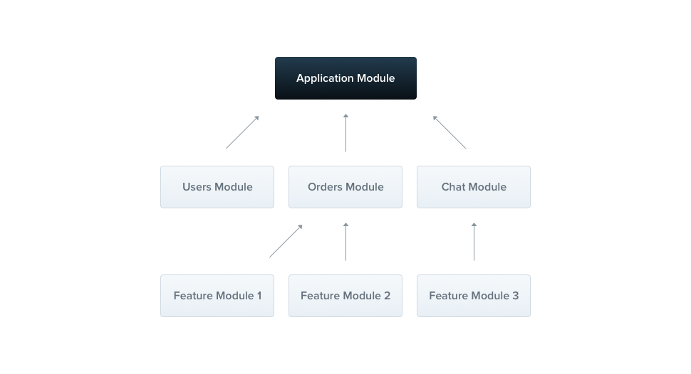
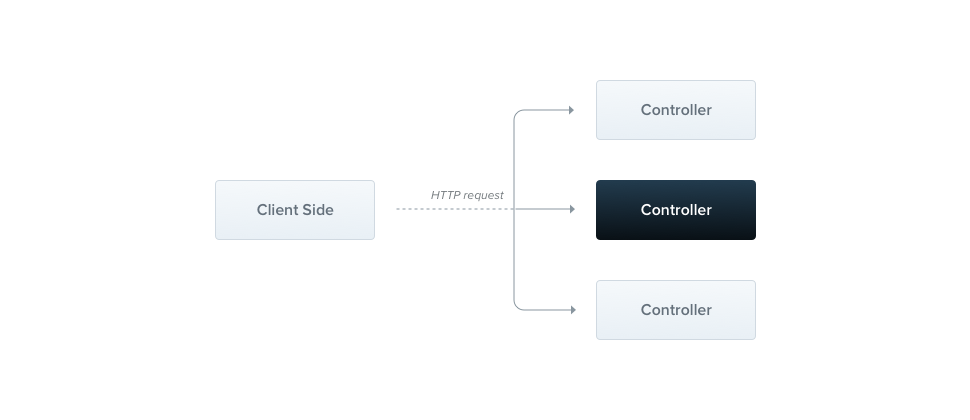

# 0. NestJS recap

Nest is a framework for building efficient and scalable server-side applications with Node.js using Express (default) or Fastify as the HTTP Server.

Nest's architecture is heavily inspired by Angular. Nest architecture contains:

- Modules (`nest generate module`) organize and establish clear boundaries, grouping related Controllers/Resolvers/Services together. Modules can import other modules. There is a root module called `AppModule` which is responsible for starting the application.
    - Diagram
        
        
        
- Controller (`nest generate controller`) defining REST endpoints. Each controller has one or more route handlers for each endpoint.
    - Diagram
        
        
        
- Services (`nest generate service`) implement and isolate business logic. Services are a kind of [provider](https://docs.nestjs.com/providers).