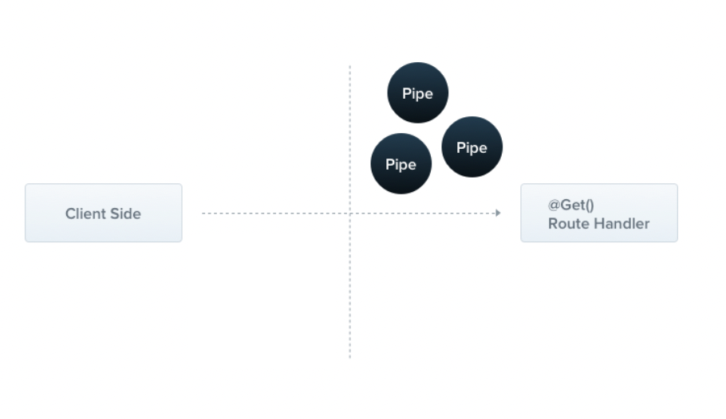
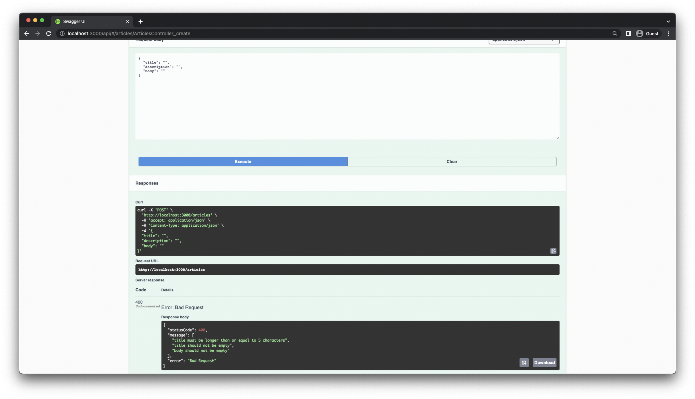
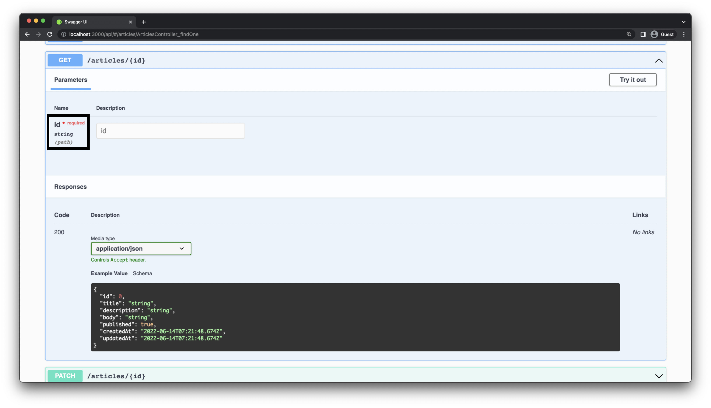

# 3. Input Validation

## Goal

In this lesson, you will learn how to validate the input to your REST API so that it conforms to your API specifications. It is best practice to validate the correctness of any data sent into a web application. This can help prevent malformed data and abuse of your API. For example, right now you can create an article that looks like this: 

```tsx
{
  "title": "",
  "description": "",
  "body": ""
}
```

## Setup

The start for this lesson is the `lesson-3-begin` branch of [this repo](https://github.com/TasinIshmam/nestjs-workshop-prisma-day-22). Before you switch to that branch, you need to commit the current state of your project. For simplicity, you can use the `stash` command:

```bash
git add .
git stash
git checkout lesson-3-begin
```

## Tasks: Input Validation

In order to perform input validation, you will be using the [NestJS Pipes.](https://docs.nestjs.com/pipes)  A pipe is a class annotated with the `@Injectable()` decorator, which implements the `PipeTransform` interface. Pipes operate on the arguments being processed by a controller route handler. Nest interposes a pipe just before a method is invoked, and the pipe receives the arguments destined for the method and operates on them. The pipes can perform transformations or validations on the arguments, after which the route handler is invoked with any (potentially) transformed arguments.



How Pipes work (from the [NestJS docs](https://docs.nestjs.com/pipes)) 

### Task 1: Set up `ValidationPipe` globally

In order to perform input validation, you will be using a built-in NestJS `ValidationPipe`. The `ValidationPipe`provides a convenient approach to enforce validation rules for all incoming client payloads, where the specific rules are declared with simple…decorators! In order to use this feature, you will need to add two packages. 

```bash
npm install class-validator class-transformer
```

Now add the `ValidationPipe` globally to your application using the `useGlobalPipes` command in `main.ts`.

- **Solution**
    
    ```tsx
    // src/main.ts
    
    import { NestFactory } from '@nestjs/core';
    import { AppModule } from './app.module';
    import { SwaggerModule, DocumentBuilder } from '@nestjs/swagger';
    **import { ValidationPipe } from '@nestjs/common';**
    
    async function bootstrap() {
      const app = await NestFactory.create(AppModule);
    
      **app.useGlobalPipes(new ValidationPipe());**
    
      const config = new DocumentBuilder()
        .setTitle('Median')
        .setDescription('The Median API description')
        .setVersion('0.1')
        .build();
      const document = SwaggerModule.createDocument(app, config);
      SwaggerModule.setup('api', app, document);
    
      await app.listen(3000);
    }
    bootstrap();
    ```
    

### Task 2: Add validation rules to `CreateArticleDto`

You can use the [`class-validator`](https://github.com/typestack/class-validator) package to add validation decorators to `CreateArticleDto`. These rules will be picked up by the `ValidationPipe` and applied automatically to your route handlers. You will apply the following rules to `CreateArticleDto`: 

1. `title` can’t be empty and has to have a minimum length of 5. 
2. `description` has to have a maximum length of 300.
3. `body` can’t be empty.
4. `title`, `description` and `body` must be of type `string` and `published` must be of type `boolean`. 
- **Solution**
    
    ```tsx
    // src/articles/dto/create-article.dto.ts
    
    import { ApiProperty } from '@nestjs/swagger';
    import {
      IsBoolean,
      IsNotEmpty,
      IsOptional,
      IsString,
      MaxLength,
      MinLength,
    } from 'class-validator';
    
    export class CreateArticleDto {
      @IsString()
      @IsNotEmpty()
      @MinLength(5)
      @ApiProperty()
      title: string;
    
      @IsString()
      @IsOptional()
      @MaxLength(300)
      @ApiProperty({ required: false })
      description?: string;
    
      @IsString()
      @IsNotEmpty()
      @ApiProperty()
      body: string;
    
      @IsBoolean()
      @IsOptional()
      @ApiProperty({ required: false, default: false })
      published?: boolean = false;
    }
    ```
    

Try creating the same empty article example from the beginning of this chapter, you should get very detailed errors. 

- Test `POST /articles` endpoint with invalid data
    
    
    

### Task 3: Use `ParseIntPipe` to transform dynamic URL paths

You are currently accepting the `id` parameter for the `GET /articles/{id}` , `PATCH /articles/{id}` , `DELETE /articles/{id}` endpoints as a part of the path. NestJS parses the `id` parameter as a string from the URL path, which is cast to a number before being passed to the `ArticlesService`. 

```tsx
// src/articles/articles.controller.ts

@Delete(':id')
@ApiOkResponse({ type: ArticleEntity })
remove(@Param('id') id: string) {   // id is parsed as a string
  return this.articlesService.remove(+id); // id is converted to number using the expression '+id' 
}
```

Since `id` is defined as `string` the Swagger API also documents this argument as a string in the generated API docs. This is unintuitive and incorrect. 

- Swagger documentation for `id` parameter
    
    
    

Instead of doing this transformation inside the route handler, you can use a NestJS pipe to achieve the same thing. NestJS has a built-in pipe for this exact use case called `ParseIntPipe`. Convert `id` to an integer and bind the `ParseIntPipe` to the controller route handlers for these three endpoints. 

- **Solution**
    
    ```tsx
    // src/articles/articles.controller.ts
    
    import {
      Controller,
      Get,
      Post,
      Body,
      Patch,
      Param,
      Delete,
      NotFoundException,
      **ParseIntPipe,**
    } from '@nestjs/common';
    
    export class ArticlesController {
      // ... 
    
      @Get(':id')
      @ApiOkResponse({ type: ArticleEntity })
      **async findOne(@Param('id', ParseIntPipe) id: number) {**
        const article = await this.articlesService.findOne(id);
    
        if (!article) {
          throw new NotFoundException(`Could not find article with ${id}.`);
        }
        return article;
      }
    
      @Patch(':id')
      @ApiCreatedResponse({ type: ArticleEntity })
      update(
        **@Param('id', ParseIntPipe) id: number,**
        @Body() updateArticleDto: UpdateArticleDto,
      ) {
        return this.articlesService.update(id, updateArticleDto);
      }
    
      @Delete(':id')
      @ApiOkResponse({ type: ArticleEntity })
      **remove(@Param('id', ParseIntPipe) id: number) {**
        return this.articlesService.remove(id);
      }
    }
    ```
    

Now, the Swagger documentation will correctly specify the `id` parameter as a `number`. 

## Implement yourself

<aside>
⌨️ You get 5 minutes to complete the tasks.

</aside>